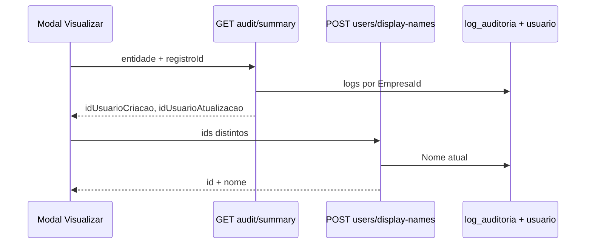

# Auditoria nos modais Visualizar

Documentação complementar à regra [22-auditoria-visualizar.mdc](../rules/22-auditoria-visualizar.mdc).

## Fluxo de dados

## Mapeamento `entidade-auditoria` (front → backend)

| `entidade-auditoria` | Tela / componente |
|----------------------|-------------------|
| `Paciente` | `PacienteDetalheDialog` |
| `Agendamento` | `AgendamentoDetalheDialog` |
| `CompraPaciente` | `ComprasListPage`, `PacienteComprasListPage` |
| `Produto` | `ProdutosListPage` |
| `TipoProduto` | `TiposProdutoListPage` |
| `UnidadeMedida` | `UnidadesMedidaListPage` |
| `Fornecedor` | `FornecedoresListPage` |
| `PedidoFornecedor` | `PedidosFornecedorListPage` |
| `MovimentacaoEstoque` | `MovimentacoesEstoqueListPage` |
| `Funcionario` | `FuncionariosListPage` |
| `Cargo` | `CargosListPage` |
| `Unidade` | `UnidadesListPage` |
| `Procedimento` | `ProcedimentosListPage` |
| `Sintoma` | `SintomasListPage` |
| `Pacote` | `PacotesListPage` |
| `AplicacaoPaciente` | `AplicacoesPacienteListPage` |
| `HorarioFuncionamentoUnidade` | `HorarioFuncionamentoUnidadePanel` (log ainda não gravado no backend) |

## Serviços front

- `src/services/auditoria.service.ts` — resumo (IDs).
- `src/services/usuario-display.service.ts` — nomes atuais.

## Novo módulo CRUD

1. Garantir `RegisterEntityChangeAsync` no backend com `nameof(Entidade)`.
2. Listagem: `app-entity-details-dialog` + `entidade-auditoria="Entidade"`.
3. Modal customizado: incluir `app-entity-audit-section` antes das ações do dialog.
