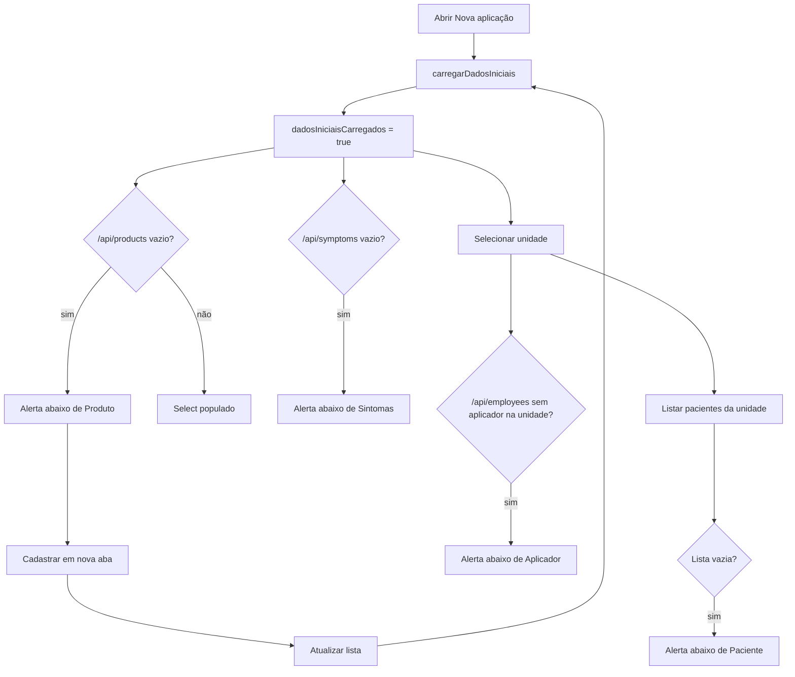

# 07 — Alertas de dependência em formulários

Quando um formulário depende de cadastros prévios (produtos, unidades, aplicadores etc.), exibir orientação clara **sem fechar a tela atual**.

Referência principal: `AplicacaoPacienteFormPage.vue`.

---

## Componente

| Item | Valor |
|------|--------|
| Arquivo | `src/components/shared/AppFormDependenciaAlert.vue` |
| Registro global | `AppFormDependenciaAlerta` em `src/boot/components.ts` |
| Tag no template | `<app-form-dependencia-alerta>` |

### ⚠️ Regra de nomenclatura (obrigatória)

O arquivo termina em `Alert.vue` (inglês), mas o registro e o template usam **`Alerta`** (português).

| Onde | Nome correto | Errado (não renderiza) |
|------|----------------|-------------------------|
| `components.ts` | `AppFormDependenciaAlerta` | `AppFormDependenciaAlert` |
| Template | `<app-form-dependencia-alerta>` | `<app-form-dependencia-alert>` |

Vue converte PascalCase → kebab-case. `Alert` vira `alert`; `Alerta` vira `alerta`. São tags **diferentes**.

Se o alerta não aparecer na tela e a lógica `v-if` estiver correta, **verificar o nome do registro primeiro**.

---

## Props e eventos

| Prop | Uso |
|------|-----|
| `mensagem` | Texto explicando o que falta |
| `rotuloAcao` | Label do link de cadastro |
| `destino` | Rota Vue Router (`RouteLocationRaw`) |
| `inline` | Variante compacta abaixo do campo (sem borda/card) |

| Evento | Uso |
|--------|-----|
| `atualizar` | Recarregar listas após cadastro em outra aba |

Ações do componente:

- **Atualizar lista** — emite `atualizar` → chamar `recarregarDependencias()` na página
- **Cadastrar X** — abre rota em **nova aba** (`target="_blank"`)

---

## Quando exibir o alerta

Regra simples: **se a API retornar `data: []`, mostrar o alerta**.

A API responde no formato:

```json
{
  "data": [],
  "success": true,
  "message": null
}
```

Os services em `src/services/*.service.ts` fazem `return data.data ?? []` no `listar()`.

Na página, após `carregarDadosIniciais()`:

```ts
const dadosIniciaisCarregados = ref(false);

// Exemplo — produtos (/api/products)
const mostrarAlertaProdutos = computed(
  () => dadosIniciaisCarregados.value && produtosDisponiveis.value.length === 0,
);

// Exemplo — aplicador (/api/employees), só após unidade selecionada
const mostrarAlertaAplicadores = computed(
  () =>
    dadosIniciaisCarregados.value &&
    Boolean(form.unidadeId) &&
    opcoesAplicadores.value.length === 0,
);
```

| Campo | Endpoint | Condição do alerta |
|-------|----------|-------------------|
| Produto | `GET /api/products` | `produtosDisponiveis.length === 0` |
| Sintoma | `GET /api/symptoms` | `sintomasDisponiveis.length === 0` |
| Aplicador | `GET /api/employees` | unidade selecionada + `opcoesAplicadores.length === 0` |
| Paciente | `GET /api/patients?unidadeId=` | unidade selecionada + `pacientesDisponiveis.length === 0` |
| Unidade | `GET /api/units` | `unidadesDisponiveis.length === 0` |

Usar `normalizarLista()` ao atribuir respostas: `lista.value = normalizarLista(resposta)`.

`dadosIniciaisCarregados` deve virar `true` no `finally` de `carregarDadosIniciais`, mesmo se a API falhar.

---

## Posicionamento no template

### Correto — alerta como irmão do campo

```vue
<div class="form-field-stack">
  <q-select
    v-model="form.produtoId"
    :options="opcoesProdutos"
    :disable="!podeEditarCampos || camposImutaveis"
  />
  <app-form-dependencia-alerta
    v-if="mostrarAlertaProdutos"
    inline
    mensagem="Nenhum produto cadastrado..."
    rotulo-acao="Cadastrar produto"
    :destino="{ name: 'produtos-novo' }"
    @atualizar="recarregarDependencias"
  />
</div>
```

### Incorreto — alerta no `#hint` com campo `disabled`

```vue
<!-- NÃO FAZER -->
<q-select :disable="opcoes.length === 0">
  <template #hint>
    <app-form-dependencia-alerta ... />
  </template>
</q-select>
```

O Quasar **oculta** `q-field__bottom` quando o campo está `disabled`.

### Incorreto — desabilitar por lista vazia

```vue
<!-- NÃO FAZER -->
:disable="!podeEditar || opcoesProdutos.length === 0"
```

Desabilitar apenas por permissão, somente leitura ou pré-requisito (ex.: paciente sem unidade).

---

## Fluxo — Nova aplicação



### `recarregarDependencias()`

Deve:

1. Chamar novamente os `listar()` das dependências
2. Se houver unidade selecionada, recarregar pacientes da unidade
3. Recarregar saldo de estoque se produto/unidade já estiverem preenchidos

---

## Páginas que usam o padrão

| Página | Dependências |
|--------|----------------|
| `AplicacaoPacienteFormPage` | unidade, paciente, produto, aplicador, sintomas |
| `PacienteFormPage` | unidade |
| `FuncionarioFormPage` | unidade, cargo |
| `ProdutoFormPage` | tipo de produto, unidade de medida |
| `PedidoFornecedorFormPage` | fornecedor, unidade, produto |

---

## CSS

| Classe | Uso |
|--------|-----|
| `form-field-stack` | Empilha campo + alerta (`gap: var(--ds-space-2)`) |
| `form-dependencia-alerta--inline` | Variante sem card, abaixo do campo |

Definido em `src/css/design-system/_patterns.scss` e no scoped do componente.

---

## Checklist ao adicionar alerta em novo formulário

- [ ] Registrar componente como `AppFormDependenciaAlerta` (não `Alert`)
- [ ] Template com `<app-form-dependencia-alerta>` (não `alert`)
- [ ] Alerta **fora** do `q-select`, dentro de `form-field-stack`
- [ ] `v-if` baseado em `lista.length === 0` após carga da API
- [ ] `:disable` **sem** `lista.length === 0`
- [ ] `@atualizar` chama refetch das listas
- [ ] Link de cadastro abre em nova aba (já embutido no componente)

---

## Plano de teste manual

1. Clínica sem produto, sintoma e aplicador (API retorna `data: []`)
2. Abrir **Aplicações → Nova aplicação**
3. Ver alertas abaixo de **Produto** e **Sintomas**
4. Selecionar unidade → alertas de **Paciente** e **Aplicador** (se vazios)
5. **Cadastrar X** → nova aba → cadastrar → voltar
6. **Atualizar lista** → select populado
7. Salvar aplicação com sucesso
